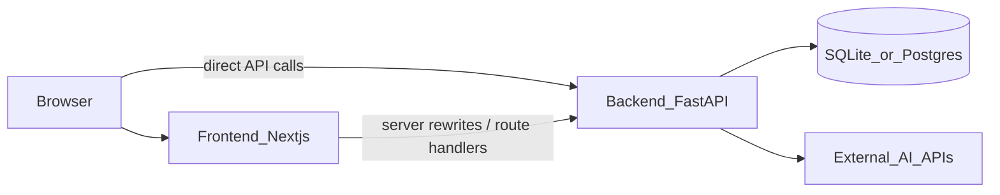

# BitWizards

AI-powered, hyper-local discovery and trust layer that re-imagines Myntra for Tier-2 and Tier-3 (T2/T3) India.

> **"The next Myntra customer does not live in a metro."**

E-commerce search often defaults to generic keyword catalogs. Shoppers in non-metro India are driven by regional micro-seasons, weather, local language dialects, community trust, and festival calendars. **BitWizards** (the Myntra Bharat Layer) makes the platform culturally aware, context-personalized, and locally connected.

## Core capabilities

1. **AI Bharat Feed** — Location-aware homepage adapting to weather, local trends, budget, and festivals (e.g. Teej, Onam, Chhath Puja).
2. **Genie (natural language shopping)** — Search in local phrasing and dialects (e.g. *"Cotton office wear for Chennai weather under ₹1500"*).
3. **Local Bazaar** — Bridge to verified local boutiques and tailors, including mock **"Request Best Price"** negotiation.
4. **Outfit Circle** — Cooperative social canvas for sharing styles, voting, commenting, and collaborating.
5. **Sahi Daam** — Price-guessing / discovery game with rewards and recommendations.
6. **Explainable AI badges** — Transparency tags (e.g. *"Trending in Lucknow"*, *"Suitable for current monsoon"*) to build trust.

## Repository layout

| Path | Role |
|------|------|
| [`backend/`](backend/) | FastAPI API, SQLModel DB, AI integrations |
| [`frontend/`](frontend/) | Next.js App Router UI |
| [`docker-compose.yml`](docker-compose.yml) | Orchestrates both services |

Component details: [backend/README.md](backend/README.md) · [frontend/README.md](frontend/README.md)

## Architecture



- **UI**: Next.js on port `3000`
- **API**: FastAPI on port `8000` (OpenAPI at `/docs`)
- **DB**: SQLite by default; set `DATABASE_URL` for Postgres (e.g. Supabase)
- **AI**: Groq / Gemini / Pinecone / Pruna / Hugging Face — most keys are optional; features degrade gracefully when unset

## Prerequisites

- **Python** 3.12+
- **Node.js** 22+
- **Docker** + Docker Compose (optional, for containerized run)

## Quick start (local)

### 1. Backend

```bash
cd backend
python -m venv venv
source venv/bin/activate   # Windows: venv\Scripts\activate
pip install -r requirements.txt
cp .env.example .env       # edit keys as needed
uvicorn app.main:app --host 0.0.0.0 --port 8000 --reload
```

API: [http://localhost:8000](http://localhost:8000) · Docs: [http://localhost:8000/docs](http://localhost:8000/docs)

### 2. Frontend

In a second terminal:

```bash
cd frontend
npm install
npm run dev
```

UI: [http://localhost:3000](http://localhost:3000)

The frontend expects the backend at `http://localhost:8000` by default.

## Quick start (Docker Compose)

```bash
# Optional API keys
cp backend/.env.example backend/.env

docker compose up --build
```

| Service | URL |
|---------|-----|
| Frontend | [http://localhost:3000](http://localhost:3000) |
| Backend | [http://localhost:8000](http://localhost:8000) |
| OpenAPI | [http://localhost:8000/docs](http://localhost:8000/docs) |

SQLite data persists in the `backend_data` volume (`/app/data/myntra.db` inside the backend container).

Stop with `Ctrl+C` or `docker compose down`.

## Environment overview

| Variable | Where | Purpose |
|----------|-------|---------|
| `GROQ_API_KEY` | backend | NL search / explanations (recommended) |
| `DATABASE_URL` | backend | Postgres URI; omit for local SQLite |
| `GEMINI_API_KEY`, `PINECONE_API_KEY`, `PRUNA_API_KEY`, `HF_API_KEY` | backend | Optional AI / try-on integrations |
| `OPENWEATHER_API_KEY` | backend | Live weather; simulated fallback if unset |
| `SUPABASE_URL` / `SUPABASE_KEY` | backend | Optional backend Supabase config |
| `NEXT_PUBLIC_API_URL` | frontend | Browser-facing API base (default `http://localhost:8000`) |
| `API_INTERNAL_URL` | frontend | Server-side / Docker internal API URL |
| `NEXT_PUBLIC_SUPABASE_*` | frontend | Optional client Supabase auth |

Full lists: [backend/README.md](backend/README.md#environment-variables) · [frontend/README.md](frontend/README.md#environment-and-api-wiring)

## Tech stack

- **Frontend**: Next.js 16, React 19, Tailwind CSS, Framer Motion, Zustand
- **Backend**: FastAPI, SQLModel / SQLAlchemy, Uvicorn
- **Data**: SQLite (local) or Postgres; optional Pinecone / embeddings
- **AI**: Groq, Gemini, and related providers via env keys

## Useful URLs

| What | URL |
|------|-----|
| App | http://localhost:3000 |
| API health | http://localhost:8000/ |
| Interactive API docs | http://localhost:8000/docs |
